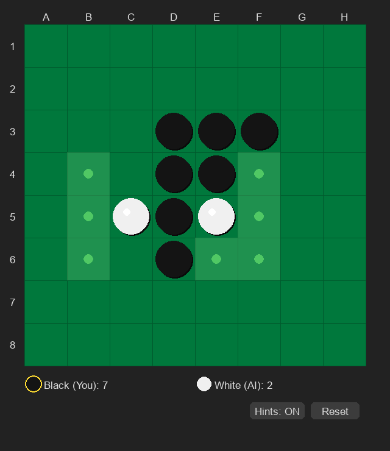

# Day 012 — Othello

pygame 製のオセロゲーム。プレイヤー（黒）vs AI（白）の 1 人用。

## スクリーンショット



## 起動方法

```bash
pip install -r requirements.txt
python othello.py
```

## 操作

| 操作 | 動作 |
|------|------|
| マス目クリック | 黒石を置く |
| `R` キー | リセット |
| Hints ボタン | 配置候補の表示 ON/OFF |
| Reset ボタン | リセット |

## 機能

- 8×8 オセロボード
- 有効手ハイライト（緑点）
- AI 対戦（深さ 4 のミニマックス + α-β 枝刈り + 位置重み評価）
- スコアリアルタイム表示
- パス自動判定（有効手なしで自動ターン交代）
- ゲームオーバー判定・勝敗表示

## 技術スタック

- Python 3.12
- pygame 2.6
- AI：Minimax (depth=4) + Alpha-Beta pruning + position weight heuristic
