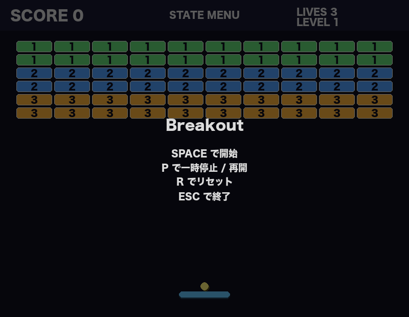

# Day013 ブロック崩し



## 概要
Python と pygame で作ったシンプルなブロック崩しゲームです。

## 実行方法
```bash
pip install -r requirements.txt
python breakout.py
```

## 操作方法
- `← / →`: パドル移動
- `マウス移動`: パドル移動
- `SPACE`: 開始 / ボール発射
- `P`: 一時停止 / 再開
- `R`: リセットしてメニューへ戻る
- `ESC`: 終了

## 技術スタック
Python + pygame
