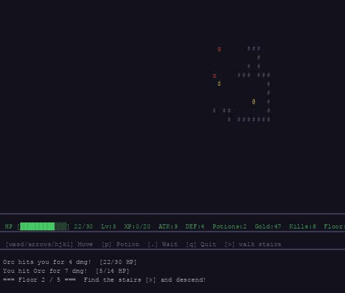

# day017 — roguelike

ターミナルで動くローグライクダンジョン探索ゲーム。



## 起動

```bash
python3 game.py
```

Python 3.10 以上・標準ライブラリのみ（curses）。

## 操作

| キー | 動作 |
|------|------|
| `wasd` / `↑↓←→` / `hjkl` | 移動・攻撃 |
| `p` / `i` | ポーション使用 |
| `.` | 1 ターン待機 |
| `q` | 終了 |

モンスターのいるマスへ移動すると自動で攻撃。階段 `>` を踏むと次の階へ。

## ゲーム内容

- **5 フロア**構成。全フロアを突破すれば勝利
- **視野システム (FOV)** — 探索済みタイルは薄く表示
- **4 種のモンスター** — Goblin / Orc / Troll / Dragon（階層が深いほど強敵）
- **レベルアップ** — 撃破で XP 獲得、一定値で HP / ATK / DEF 上昇
- **アイテム** — Health Potion (`!`) / Gold (`$`)

## 技術

- Python 標準ライブラリ `curses`（pygame 不使用）
- ランダムダンジョン生成（部屋 + 通路方式）
- レイキャスト FOV（360 本のレイ）
- ターンベース AI（視野内で追跡、視野外でランダム徘徊）
