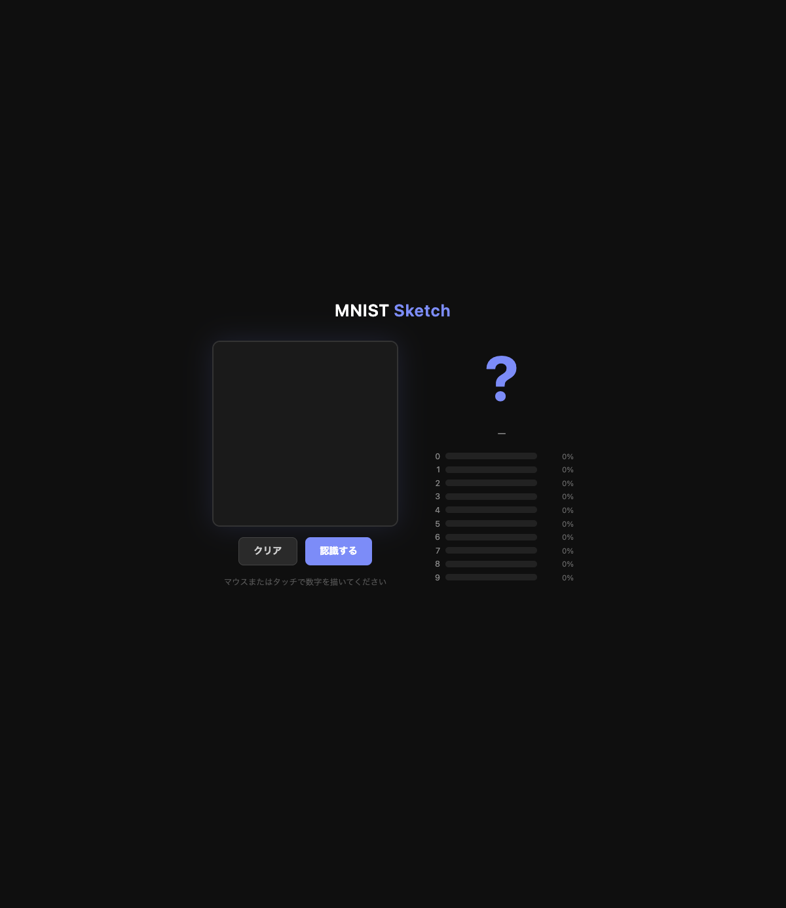
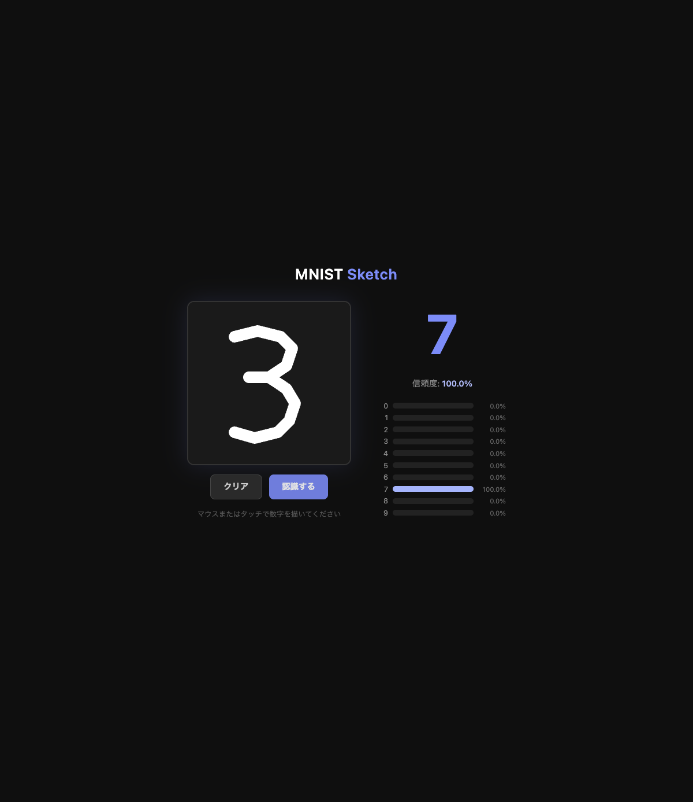

# Day019 — MNIST Sketch

## 概要

Canvas に手書きした数字（0〜9）を機械学習モデルがリアルタイム認識する Web アプリ。
MLP（多層パーセプトロン）を scikit-learn で MNIST データセットから学習し、FastAPI で推論 API を提供する。




## 技術スタック

- Language: Python 3.12
- ML: scikit-learn（MLPClassifier）
- API: FastAPI + uvicorn
- Frontend: Vanilla JS + HTML Canvas API（ライブラリなし）
- その他: Pillow（画像前処理）

## 起動方法

```bash
# セットアップ
python3 -m venv .venv
source .venv/bin/activate
pip install -r requirements.txt

# モデル学習（初回のみ・数分かかる）
python train.py

# サーバー起動
uvicorn api:app --reload --port 8019
```

ブラウザで http://localhost:8019 を開き、Canvas に数字を描いて「認識する」を押す。

## 機能一覧

### 実装済み

- [x] Canvas 手書き入力（マウス・タッチ対応）
- [x] 28×28 にダウンサンプリングして ML モデルへ送信
- [x] MLP による 0〜9 分類（テスト精度 97.04%）
- [x] 認識結果と信頼度の表示
- [x] 0〜9 各クラスの確率バーチャート
- [x] クリアボタンでリセット

### 今後の改善候補（任意）

- [ ] リアルタイム認識（描くたびに自動推論）
- [ ] CNN への置き換え（精度向上）
- [ ] 複数桁の認識

## 開発ログ

### 学んだこと

- `fetch_openml` は `parser="liac-arff"` を指定しないと pandas が必要になる
- Canvas の描画内容は `toDataURL("image/png")` で Base64 に変換して API に投げられる
- MNIST は白地に黒なので、黒地に白で描いた Canvas は `ImageOps.invert()` で反転が必要
- MLP 20 イテレーションで 97% 精度に達した

### 詰まったこと・解決方法

- `parser="auto"` が pandas を要求 → `parser="liac-arff"` に変更
- 前処理の色反転を忘れて全部「1」と認識された → `ImageOps.invert()` を追加

### 次回やってみたいこと

- PyTorch + CNN での同様の実装（精度 99%+ を目指す）
- 手書き文字（ひらがななど）への応用
