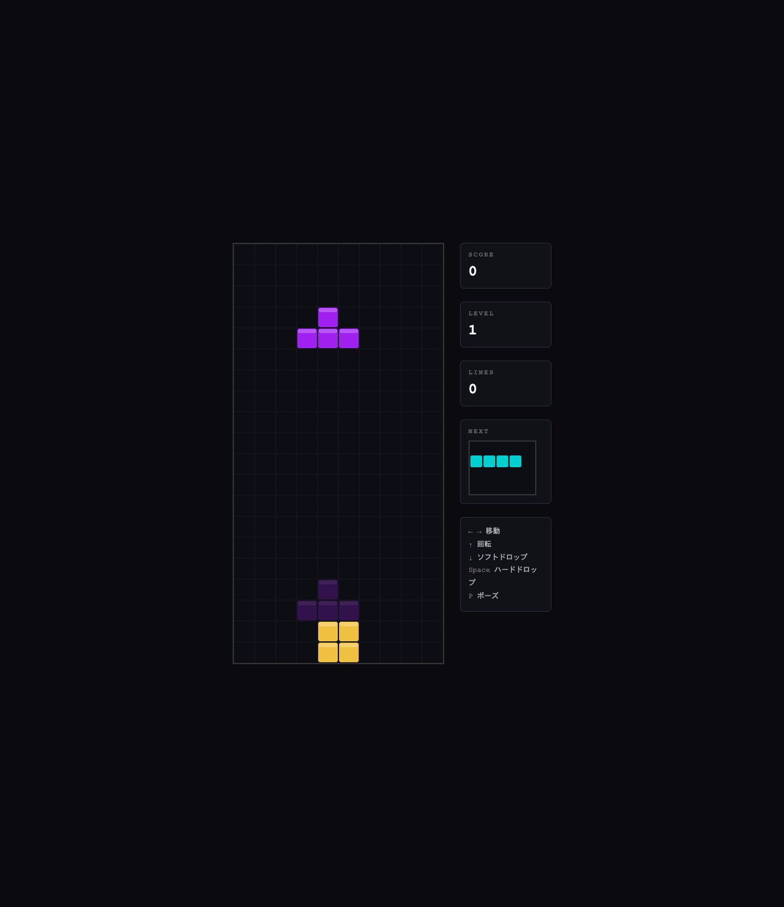

# Day020 — Tetris

## 概要

TypeScript + Vite + Canvas API で作ったブラウザ動作のテトリス。
型安全なゲーム状態管理・ゴーストピース・ウォールキック・レベルアップに対応。



## 技術スタック

- Language: TypeScript 5.4
- Bundler: Vite 5
- Rendering: Canvas 2D API（フレームワークなし）

## 起動方法

```bash
# セットアップ
npm install

# 開発サーバー起動
npm run dev
# → http://localhost:5173/ をブラウザで開く

# 本番ビルド
npm run build
```

## 操作方法

| キー | 操作 |
|------|------|
| ← → | 左右移動 |
| ↑ | 回転 |
| ↓ | ソフトドロップ |
| Space | ハードドロップ |
| P | ポーズ / 再開 |

## 機能一覧

### 実装済み

- [x] 7 種テトロミノ（I / O / T / S / Z / J / L）
- [x] ゴーストピース（落下先のプレビュー）
- [x] ウォールキック（壁際での回転補正）
- [x] ライン消去（1〜4 ライン対応、Tetris スコアリング）
- [x] レベルアップ（10 ライン毎、落下速度増加）
- [x] ネクストピース表示
- [x] ハードドロップ / ソフトドロップ
- [x] ポーズ機能
- [x] ゲームオーバー / リトライ

### 今後の改善候補

- [ ] ホールド機能
- [ ] BGM / SE
- [ ] ハイスコア保存（localStorage）
- [ ] モバイルタッチ操作

## 開発ログ

### 学んだこと

- TypeScript の判別可能なユニオン型（`TetrominoType`）でゲーム状態を型安全に管理できる
- Canvas の `roundRect` API で角丸セルを手軽に描画できる（Chrome 99+ / Firefox 112+）
- `requestAnimationFrame` のタイムスタンプでフレームレートに依存しないゲームループが作れる

### 詰まったこと・解決方法

- `tsconfig.json` で `allowImportingTsExtensions` を有効にしないと `.ts` 拡張子付き import が通らない
- `roundRect` の型定義が TypeScript 標準ライブラリにないため `target: "ES2020"` で解決

### 次回やってみたいこと

- WebSocket を使ったリアルタイム対戦
