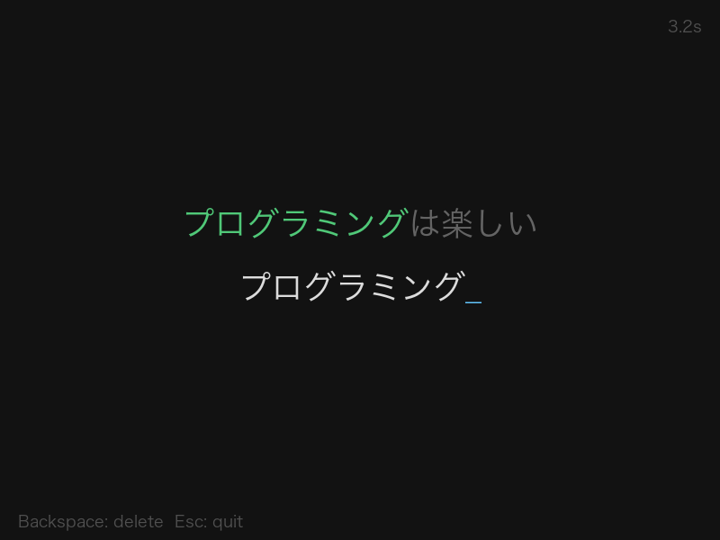

# Day021 — Typing Game

## 概要

Pygame で作ったタイピングゲーム。日本語・英語のお題文字列をタイプし、正確率と CPM（1 分あたりの文字数）を計測する。IME 対応により日本語入力にも対応。



## 技術スタック

- Language: Python 3.12
- Library: Pygame 2.6.1
- Font: Hiragino Sans GB（macOS 標準日本語フォント）

## 起動方法

```bash
# Pygame のインストール（未インストールの場合）
pip install pygame

# 起動
python main.py
```

## 操作方法

| キー | 操作 |
|------|------|
| 任意のキー | 文字を入力 |
| Backspace | 直前の文字を削除 |
| Enter | リトライ（リザルト画面のみ） |
| Esc | 終了 |

## 機能一覧

- [x] ランダムなお題文字列の表示（英語・日本語）
- [x] 入力と照合してリアルタイムで正誤を色付け（緑 / 赤）
- [x] IME 対応 — 変換中テキストを下線付きで表示
- [x] 経過時間の計測（最初のキー入力から開始）
- [x] リザルト表示（タイム / CPM / 正確率）
- [x] リトライ機能

## 開発ログ

### 学んだこと

- Pygame のキー入力は `KEYDOWN` + `event.unicode` で英字は取れるが、日本語 IME には対応できない
- `pygame.key.start_text_input()` を呼ぶと `TEXTINPUT` / `TEXTEDITING` イベントが有効になり、IME 経由の日本語入力を受け取れる
- `TEXTINPUT` は確定テキスト、`TEXTEDITING` は変換中の未確定テキスト。英語も `TEXTINPUT` 経由で来るので日英の分岐は不要
- 文字ごとに色を変えるには `font.render()` を 1 文字ずつ呼んで `blit` を繰り返す必要がある（文字列まとめて render すると全体が同色になる）
- IME 変換中は Backspace を OS 側の IME が処理するため、コード側で `typed[:-1]` を実行しないよう `composing` フラグで制御が必要
