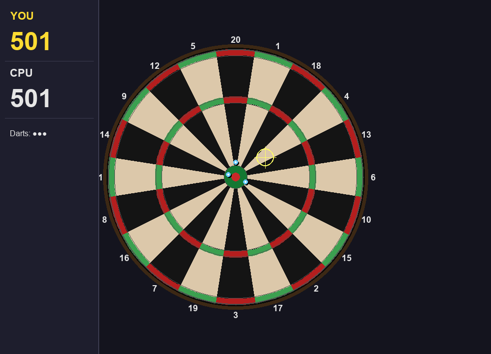

# Day022 — Darts

## スクリーンショット



## 概要

Python + pygame で実装したダーツゲーム。501 ルールで YOU vs CPU の 1 対 1 対戦。
マウスで照準を合わせてクリック投擲。CPU はスコアに応じてトリプル 20 狙い・ダブルフィニッシュを自動判断する。

## 技術スタック

- Language: Python 3.11+
- Library: pygame

## 起動方法

```bash
# セットアップ
pip install pygame

# 実行
python main.py
```

## 操作方法

| 操作 | 説明 |
|------|------|
| マウス移動 | 照準を合わせる |
| 左クリック | ダーツを投げる（微小ブレあり） |
| R | リスタート |
| Q | 終了 |

## 機能一覧

### 実装済み

- [x] リアルなダーツボード描画（20 セグメント + ダブル / トリプルリング + ブル）
- [x] 501 ゲームルール（スコアがぴったり 0 で勝ち、1 残り・マイナスはバスト）
- [x] 1 ターン 3 本投擲、バスト時は残り本数スキップ
- [x] CPU 自動対戦（トリプル 20 狙い → ダブルフィニッシュ判断）
- [x] 照準クロスヘア表示
- [x] スコアパネル（現ターンの得点履歴）
- [x] ゲームオーバー画面 + リスタート

### 今後の改善候補

- [ ] BGM / SE の追加
- [ ] スコア履歴の保存
- [ ] CPU 難易度選択（Easy / Normal / Hard）
- [ ] 2 プレイヤーモード（同一 PC）

## 開発ログ

### 学んだこと

- ダーツボードのセグメント配置は `20,1,18,4,13,6,10,15,2,17,3,19,7,16,8,11,14,9,12,5` の固定順
- 実ボード寸法比率（DBULL=6.35mm, SBULL=15.9mm など）を使うと自然な見た目になる
- 扇形ドーナツの描画は外弧→内弧の順でポリゴン化すると綺麗に描ける

### 詰まったこと・解決方法

- セグメント角度の 12 時位置補正：atan2 の基準角と `-π/2 - halfSeg` のオフセットで一致させた
- バスト判定：`score - pts == 1` のケースも弾く（1 残りはダブルで上がれないため）

### 次回やってみたいこと

- 物理エンジンを使ったダーツの軌道アニメーション
