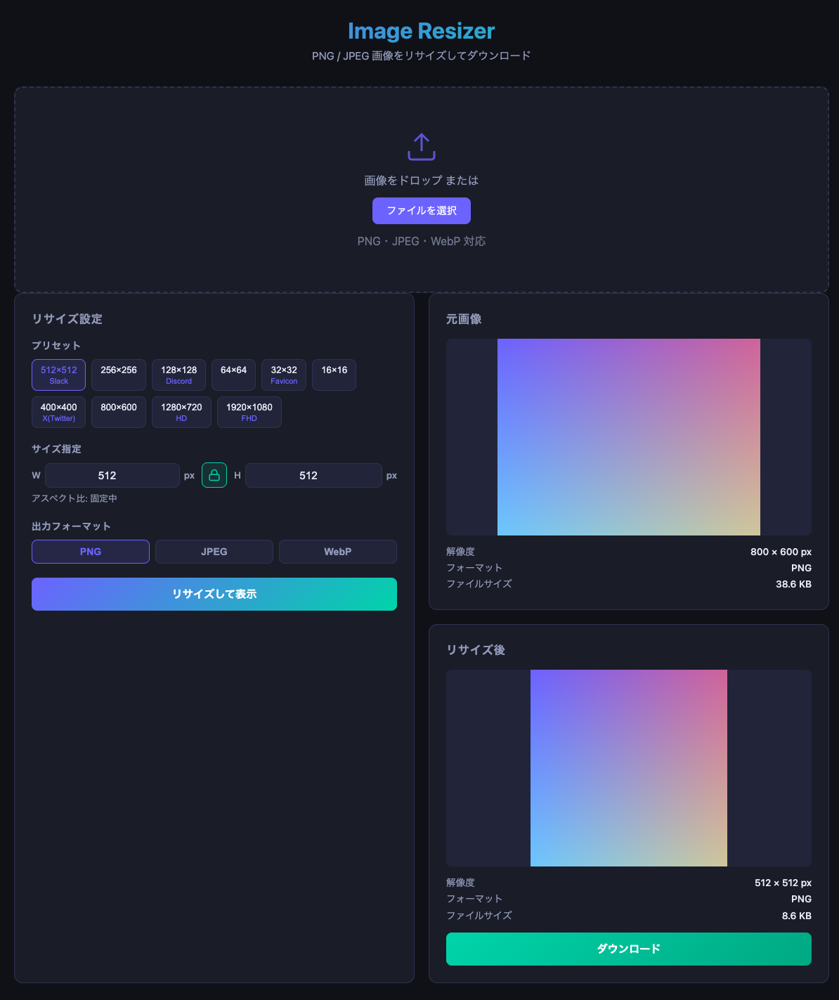

# Day028 — Image Resizer

## 概要

PNG / JPEG / WebP 画像をブラウザ上でリサイズしてダウンロードできるツール。
Slack・Discord・Twitter などのアイコン設定時にサイズ制限で弾かれる問題を解消するために作成。



## 機能

- ドラッグ&ドロップまたはファイル選択で画像をアップロード
- 幅・高さを自由に指定（アスペクト比ロック対応）
- よく使うサイズのプリセット（Slack・Discord・Favicon・X(Twitter)・HD・FHD など）
- 出力フォーマット選択：PNG / JPEG / WebP
- JPEG・WebP は品質スライダーで圧縮率を調整可能
- リサイズ前後のプレビューとファイルサイズ比較
- ファイル名に寸法を自動付与してダウンロード（例：`icon_512x512.png`）

## 技術スタック

- Language: TypeScript
- Framework/Library: Vite（バンドラーのみ）
- その他: Canvas API（外部依存なし）

## 起動方法

```bash
# セットアップ
npm install

# 開発サーバー
npm run dev

# 本番ビルド
npm run build
```

ブラウザで http://localhost:5173 を開く。
