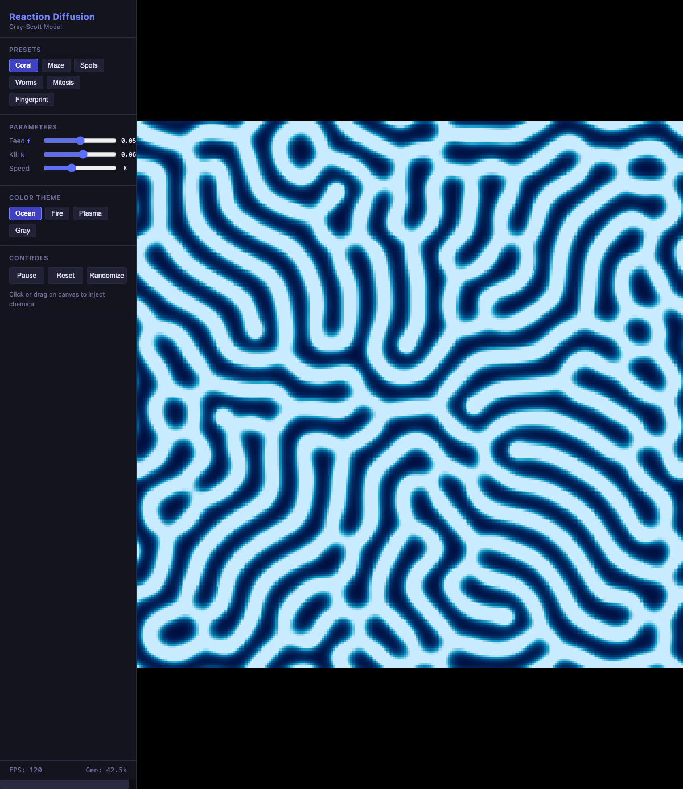

# Day030 — Reaction Diffusion

## 概要

Gray-Scott モデルによる反応拡散シミュレーター。2 種類の化学物質 A・B の拡散と反応を可視化し、coral・maze・spots・worms などの生物的パターンをリアルタイム生成する。



## 技術スタック

- Language: TypeScript
- Framework/Library: Vite
- Rendering: Canvas API + ImageData (Float32Array ベース)
- Algorithm: Gray-Scott Model with 9-point stencil Laplacian
- 外部依存: ゼロ

## 起動方法

```bash
# セットアップ
npm install

# 実行
npm run dev
```

## 機能一覧

### 実装済み

- [x] Gray-Scott 反応拡散シミュレーション（9-point Laplacian、ラッピング境界）
- [x] 6 種プリセット: Coral / Maze / Spots / Worms / Mitosis / Fingerprint
- [x] パラメーター スライダー: Feed rate (f) / Kill rate (k) / Speed
- [x] 4 種カラーテーマ: Ocean / Fire / Plasma / Gray
- [x] Pause / Resume / Reset / Randomize コントロール
- [x] Canvas クリック・ドラッグで化学物質 B を注入
- [x] FPS・世代数リアルタイム表示

### 今後の改善候補（任意）

- [ ] WebGL で GPU 並列化（より高解像度対応）
- [ ] f-k パラメーター空間マップの可視化
- [ ] PNG エクスポート

## 開発ログ

### 学んだこと

- 5-point Laplacian + dt=1.0 は不安定（CFL 条件: dt * Da / dx² ≤ 0.25 が必要）
- 9-point stencil（中心=-1, 直交=0.2, 斜め=0.05）は重みの合計が 0 になりつつ、各係数が小さく安定
- Float32Array をダブルバッファリングすることで GC なしに毎フレーム更新可能
- Gray-Scott の f-k パラメーター空間は極めて狭く、値を少し変えるだけでパターンが劇変する

### 詰まったこと・解決方法

- **チェッカーボード不安定**：Da=1.0, dt=1.0 の 5-point Laplacian で発散。9-point stencil に変更して解決
- **速度**：256×256 × 8steps/frame @ 120FPS を JavaScript の typed array で達成（WebGL 不要）

### 次回やってみたいこと

- WebGL compute shader を使った大解像度シミュレーション
- Turing パターンなど他の反応拡散モデルの実装
